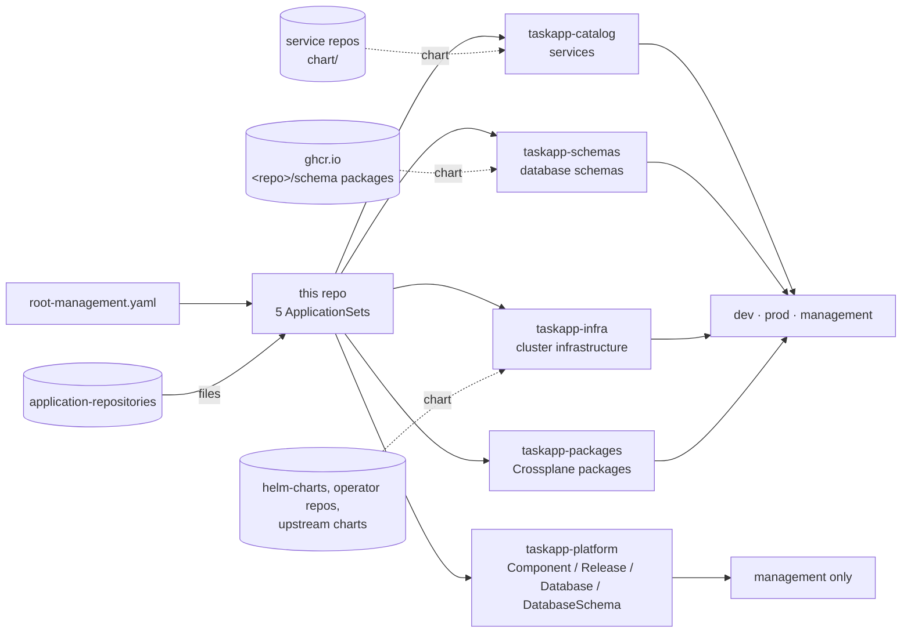

# argocd

The bootstrap for the platform's GitOps delivery. A single Argo CD instance on
the `management` cluster deploys to every cluster (`management`, `dev`, `prod`).
This repo only creates the **five ApplicationSets** that do that. What actually
runs where is decided in
[application-repositories](https://github.com/entr0pian/application-repositories).

- **One root Application, applied once.** Everything else is generated from Git.
- **No per-app config here.** Onboarding a service, a piece of infrastructure
  or a platform resource is a file in `application-repositories`, never a
  change to this repo.
- **Clusters matched by label, never by URL.** Adding an environment means
  registering a cluster, not editing every app.

## Where it fits



The files `taskapp-platform` delivers are written by Backstage pull requests.
[release-operator](https://github.com/entr0pian/release-operator) then turns
each `Release` into the `components/` files that `taskapp-catalog` deploys, and
[schema-operator](https://github.com/entr0pian/schema-operator) turns each
`DatabaseSchema` into the `components/` file that `taskapp-schemas` deploys. So
Argo CD is the only thing that applies anything, whoever wrote the commit.

## The five ApplicationSets

| ApplicationSet | Reads (in `application-repositories`) | Generates | Destination |
|---|---|---|---|
| `taskapp-catalog` | `components/<svc>/environments/<env>.yaml` | one Application per service per environment, a multi-source app whose chart comes from the service's own repo and whose values file is `components/<svc>/values/<env>.yaml` | the cluster labelled `environment: <env>` |
| `taskapp-infra` | `infra/<name>/<env>.yaml`, merged with `values/<name>/<env>.yaml` | one Application per infrastructure component per environment | the cluster labelled `environment: <env>` |
| `taskapp-packages` | `packages/<pkg>/<env>.yaml` | one Crossplane `Configuration` per package per environment, pinned to an OCI version | the cluster labelled `environment: <env>` |
| `taskapp-platform` | `platform/registry/*.yaml`, `platform/environments/<env>/*.yaml` | one Application per CR file, applied as-is | always `management`. `<env>` picks the namespace there |
| `taskapp-schemas` | `components/<svc>/schema/<env>.yaml` | one Application per service per environment whose schema is released: the service's schema package (an OCI chart, one version per commit), which renders an `AtlasMigration` for Atlas Operator | the cluster labelled `environment: <env>` |

Each one is a `matrix` of a `git` files generator and a `clusters` generator.
The environment, taken from the file's path or content, selects the Argo CD
cluster Secret with the matching `environment` label, which supplies
`destination.server`. No cluster URL appears anywhere in Git.

### Ordering and labels

- **Sync waves.** Packages sync at wave 1, `Component`s at 4, and services,
  schemas, `Release`s, `Database`s and `DatabaseSchema`s at 5. Each infrastructure file sets its own wave.
- **Discovery labels.** Applications from `taskapp-catalog`,
  `taskapp-schemas` and `taskapp-platform` carry `platform.taskapp.io/{component,environment,type,name}`.
  Backstage finds a service's Applications through these labels, never through
  Application names.
- **Platform identity.** `taskapp-catalog` passes `platform.component` and
  `platform.environment` to every service chart as Helm parameters. Scaffolded
  charts turn them into the workload labels that metrics and the portal rely
  on.

## Design choices

- **Identity separate from values.** For services and infrastructure, the file
  saying *where* a chart comes from rarely changes. The values file (image tag,
  toggles) changes on every deploy. Splitting them keeps automated writers to
  the values side.
- **Platform resources always go to management.** Platform APIs and their
  operators live only there, so no workload cluster can change the platform.
- **Fixed-shape templates.** An ApplicationSet template can fill in field
  values but can't add or remove keys. Optional parts are therefore empty
  strings (`chart` vs `path`), fixed `syncOptions` slots, and a
  pre-rendered `values` string, never conditional structure.
- **Packages install through one tiny chart.** Each Crossplane package is a
  Helm-shaped Application rendering a single `Configuration`, so it fits the
  same template as everything else.

## Clusters

All three clusters are EKS, created by Terraform. Argo CD runs on `management`
and reaches it as the in-cluster server. Each workload cluster's Terraform
publishes its endpoint and CA to AWS Secrets Manager. External Secrets turns
that into an Argo CD cluster Secret labelled `environment: <env>`, and Argo CD
authenticates through its own EKS Pod Identity, with no stored credential. When a
cluster is destroyed, its Secret disappears and Argo CD forgets it.

## Change detection

GitHub push webhooks deliver changes within seconds. Pushes to
`application-repositories` go to the ApplicationSet controller, which
creates, updates or deletes Applications. Pushes to the repos those
Applications read go to `argocd-server`. Every generator still polls every
180s as a fallback, for example for pushes made while `management` was down.

## Notifications

Argo CD Notifications posts to Slack `#deployments`. Packages always notify.
Infrastructure notifies when its file sets `notify: true`. Services and
platform resources don't notify. Their rollout state is shown on the service's
Deployments tab in Backstage.

## Bootstrap

After Argo CD is installed on `management`:

```sh
kubectl apply -f root-management.yaml
```

The root Application renders `apps/`, and the five ApplicationSets take it
from there.

```
root-management.yaml          # the root Application
apps/templates/
├── catalog-appset.yaml       # taskapp-catalog
├── infra-appset.yaml         # taskapp-infra
├── package-appset.yaml       # taskapp-packages
├── platform-appset.yaml      # taskapp-platform
└── schema-appset.yaml        # taskapp-schemas
```
